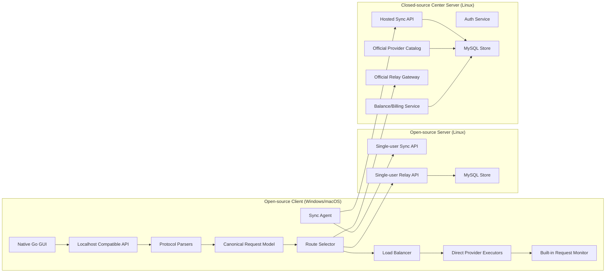

# ZenHub 项目需求文档

本文档用于定义一个适合作为简历项目的 AI 代理系统。目标不是做一个完整商用 SaaS，而是做出一套“功能闭环完整、架构亮点明确、可扩展性强、容易向面试官讲清楚”的项目。

项目代号暂定：`ZenHub`

---

## 1. 项目一句话定位

`ZenHub` 是一个面向 AI CLI 工具的低延迟跨平台代理系统，采用控制面和数据面分离设计，支持服务端中转与客户端本地直连两种路径，并通过统一协议抽象层兼容 OpenAI / Claude / Gemini / Codex 等不同输入输出格式。

---

## 2. 项目目标

本项目要解决传统中转服务器的两个痛点：

1. 所有请求都经过中心服务器，链路更长，延迟更高。
2. 用户为了获得同步、分发、统一入口等能力，往往必须完全信任中心服务器。

本项目的目标是：

1. 提供一个统一的本地代理入口，兼容多种 AI CLI / SDK 的调用方式。
2. 让用户既可以使用传统 relay 中转模式，也可以在客户端本地直接请求上游，减少额外网络跳转。
3. 通过服务器同步配置、模型映射、路由策略、官方提供商目录等控制面数据。
4. 在产品层面同时支持：
   - 开源客户端
   - 开源基础服务端
   - 闭源中心托管服务
5. 保留足够多的技术亮点，适合作为高级后端/基础设施方向的简历项目。

---

## 3. 非目标

为了避免项目失控，以下能力不作为 `v1` 强制目标：

1. 不实现真正的端到端密钥分发体系，不做设备公钥加密同步。
2. 不实现流式响应中途断流后的“无缝补流拼接”。
3. 不实现主动健康检查，只做被动健康检查。
4. 不做复杂订阅制、发票、支付渠道接入，只做余额扣费闭环。
5. 不做浏览器 OAuth 登录，托管版使用账号密码登录。
6. 不强求分布式微服务拆分，`v1` 可以是单体架构。

---

## 4. 产品形态与版本分层

本项目不是单一程序，而是一组有边界的产品形态。

### 4.1 开源客户端

定位：

- 面向 Windows 和 macOS 的本地桌面客户端
- 使用 Go 原生跨平台 GUI
- 不使用 Web 管理页，不使用 WebView 套壳
- 对外暴露本地 `localhost` 兼容 API
- 用户可直接管理自定义上游接口、路由策略、负载均衡参数、本地同步状态

作用：

1. 本地数据面入口
2. 多协议输入输出兼容代理
3. 请求观测和调试面板
4. 本地配置存储与云配置同步

### 4.2 开源基础服务端

定位：

- 主要部署在 Linux
- 提供最基础的配置存储、配置分发、基础 relay 转发能力
- 只做单用户功能，便于用户自建和审计

能力边界：

1. 支持单用户登录或单管理员模式
2. 支持用户自定义上游接口配置的存储与同步
3. 支持基础的 relay 中转
4. 支持基础负载均衡
5. 不提供多用户租户能力
6. 不提供官方提供商池和余额扣费

### 4.3 闭源中心托管服务

定位：

- 面向最终商业化运营的中心服务器
- 在开源基础服务端之上扩展多用户、官方提供商池、充值和计费

能力边界：

1. 多用户账号体系
2. 账号密码登录
3. `access token + refresh token` 会话机制
4. 用户自定义接口配置的托管同步
5. 官方提供商池和官方模型目录
6. 余额充值与按模型/用量扣费
7. 配置隔离存储
8. 可选的官方 relay 服务

### 4.4 产品价值解释

这三层分工是本项目的重要叙事：

1. 客户端开源，用于建立信任。
2. 开源服务端支持基础能力，证明核心技术不是“只会做闭源壳子”。
3. 闭源中心服务承载多用户、官方提供商池和运营能力，形成商业闭环。

---

## 5. 核心设计思想

### 5.1 控制面与数据面分离

控制面由服务端承担，负责：

1. 配置同步
2. 模型目录下发
3. 路由规则管理
4. 负载均衡参数分发
5. 官方提供商信息分发
6. 账号体系与会话

数据面由客户端和服务端共同承担：

1. `Direct Path`
   - 客户端本地直接请求用户配置的上游
   - 请求不经过中心服务器
2. `Relay Path`
   - 请求经由开源服务端或闭源中心服务端转发
   - 适合官方提供商池或用户希望集中管理时使用

### 5.2 路由决策与负载均衡解耦

必须明确区分两类决策：

1. 路由决策
   - 决定某个模型或请求走 `direct` 还是 `relay`
2. 负载均衡决策
   - 决定在当前路径所对应的上游节点池中选择哪一个节点

`v1` 要求：

1. 请求失败后，不自动在 `direct` 和 `relay` 之间切换。
2. 失败恢复发生在当前路径自己的节点池内部。
3. 某个模型走哪条路径，由配置决定，不由失败时动态改写。

### 5.3 统一协议抽象层

这是整个项目最重要的技术亮点之一，必须保留。

要求参考 `CLIProxyAPI` 的设计思想：

1. 外部输入可以是多种协议格式。
2. 内部先转换为统一的 canonical request / response model。
3. 核心链路只处理统一模型，不直接耦合某家协议。
4. 真正发给上游前，再通过 transformer / adapter 转换为目标上游协议。
5. 上游返回后，再转换为目标输出协议。

必须避免的坏设计：

1. 在每个 handler 中直接拼接各家上游请求。
2. 把路由、协议解析、负载均衡、上游执行混在一个函数里。
3. 把某个协议格式写死在核心执行链路中。

---

## 6. 兼容性目标

### 6.1 外部接口兼容目标

项目最终目标是支持多种输入和输出格式，不把系统限制为单一 OpenAI 兼容层。

架构层必须支持：

1. OpenAI-compatible Chat Completions
2. OpenAI Responses API
3. Anthropic Messages API

这里的transformer方式可以参考CliProxyAPI的写法，这是我让AI总结的文档：
G:\project\guest\CLIProxyAPI\docs\proxy-chain-architecture_CN.md

### 6.2 `v1` 交付策略

虽然架构目标是“全协议互转”，但 `v1` 可以优先落地主流高频接口，只要架构提前抽象好即可。

建议 `v1` 第一批实现：

1. `/v1/chat/completions`
2. `/v1/models`
3. 流式响应转发

但必须在代码结构上预留：

1. `protocol parser`
2. `canonical model`
3. `request transformer`
4. `response transformer`
5. `provider executor`

换句话说，`v1` 可以分阶段实现协议覆盖，但架构绝不能按“只支持一种格式”的方式写死。

---

## 7. 平台与进程模型

### 7.1 平台定位

1. Linux 主要作为服务端部署环境
2. Windows 和 macOS 主要作为桌面客户端运行环境
3. Linux 客户端不作为 `v1` 核心目标，但架构可以预留

### 7.2 客户端进程模型

客户端采用单进程模型。

一个进程同时负责：

1. 桌面 GUI
2. 本地 `localhost` API 服务
3. 协议转换
4. 路由与负载均衡
5. 配置同步
6. 请求日志与观测数据展示

单进程模型的原因：

1. 简化跨平台部署
2. 降低调试复杂度
3. 更适合作为简历项目快速闭环

后续如有需要，可在架构上预留拆分为 GUI 和后台守护进程的能力，但 `v1` 不强制。

---

## 8. 总体架构图



---

## 9. 核心请求链路

### 9.1 本地请求主链路

客户端本地请求链路建议设计为：

1. CLI 或 SDK 请求发到客户端本地 `localhost`
2. 协议解析器识别输入格式
3. 转换为统一 canonical request
4. 根据模型名和配置确定路由模式与目标 provider group
5. 在目标 group 内执行负载均衡
6. 通过目标 provider executor 发起请求
7. 接收上游响应或流式事件
8. 转换为客户端期望的输出协议
9. 返回给调用方
10. 同时写入请求观测记录

### 9.2 Relay 路径链路

当某个模型配置为 `relay` 时，链路为：

1. 调用方请求本地客户端
2. 客户端协议层解析并统一化
3. 客户端将请求转发给开源服务端或闭源中心服务端
4. 服务端执行自己的上游池路由与负载均衡
5. 服务端向真实上游发起请求
6. 服务端返回结果给客户端
7. 客户端按目标协议回写给调用方

### 9.3 Direct 路径链路

当某个模型配置为 `direct` 时，链路为：

1. 调用方请求本地客户端
2. 客户端协议层解析并统一化
3. 客户端直接访问用户自定义的上游接口
4. 客户端在本地完成负载均衡和失败切换
5. 客户端将结果转换后回写给调用方

### 9.4 必须保留的中间抽象

核心链路必须至少拆成以下层级：

1. `ingress handlers`
2. `protocol parsers`
3. `canonical request/response model`
4. `route policy`
5. `provider resolver`
6. `load balancer`
7. `provider executors`
8. `response transformers`
9. `stream writers`

---

## 10. 路由模式设计

`v1` 至少支持以下两种数据面模式：

1. `direct`
2. `relay`

说明：

1. 某个模型或 provider group 走哪种模式，由配置决定。
2. `v1` 不要求在请求失败后自动从 `direct` 切到 `relay`，或反过来切换。
3. 若未来需要 `auto` 模式，可在配置层预留，但不作为 `v1` 强制范围。

推荐配置粒度：

1. 以“模型别名”或“路由规则”为单位决定路径
2. 例如：
   - `gpt-4o` 走 `direct`
   - `claude-opus` 走 `relay`
   - `gemini-pro` 走 `direct`

---

## 11. 负载均衡设计

负载均衡是本项目第二个核心技术亮点，必须作为独立模块实现。

### 11.1 负载均衡策略

`v1` 至少支持两种策略：

1. `round_robin`
   - 节点按顺序轮询
2. `fill_first`
   - 优先把当前节点用满
   - 当前节点失败或被摘除后，再切到下一个节点

说明：

1. 对外文案可以写成 `full-fill`
2. 内部实现建议使用更明确的名称 `fill_first`

### 11.2 可配置参数

每个 provider group 都要支持以下参数：

1. `timeout`
   - 单次尝试的超时时间
2. `retry_count`
   - 当前节点内部的重试次数
3. `max_node_attempts`
   - 本次请求最多尝试多少个节点

### 11.3 失败处理规则

明确执行规则：

1. 先根据策略选出当前节点
2. 当前节点最多尝试 `retry_count` 次
3. 若该节点仍失败，则切换到下一个活跃节点
4. 整个请求最多尝试 `max_node_attempts` 个节点
5. 如果所有节点都失败，则返回最后一次错误

示例：

1. `retry_count = 2`
2. `max_node_attempts = 2`
3. 节点 A 有问题，则 A 尝试 2 次
4. 节点 B 有问题，则 B 尝试 2 次
5. 仍失败时，直接返回最后一次错误

### 11.4 健康检查模型

`v1` 只做被动健康检查。

规则：

1. 请求失败时累计节点失败次数
2. 连续失败达到阈值后，节点被标记为 `unhealthy`
3. 节点进入冷却期
4. 冷却期结束后自动恢复可选状态

不做：

1. 主动定时探活
2. 复杂延迟打分
3. 基于实时指标的动态调度

---

## 12. 协议转换与 Canonical Model 设计

这是整个项目最关键的工程抽象，必须单独设计。

### 12.1 设计目标

无论请求来自 OpenAI、Claude、Gemini 还是 Codex 风格输入，都要先转成统一内部模型。

统一模型建议至少包含：

1. `request_id`
2. `protocol`
3. `model`
4. `messages`
5. `tools`
6. `temperature`
7. `top_p`
8. `max_tokens`
9. `stream`
10. `metadata`
11. `raw_extensions`

响应统一模型建议包含：

1. `response_id`
2. `provider`
3. `model`
4. `output_chunks`
5. `finish_reason`
6. `usage`
7. `raw_extensions`

### 12.2 模块职责

建议分为：

1. `parser`
   - 将外部协议解析为 canonical request
2. `normalizer`
   - 标准化模型名、采样参数、工具字段
3. `transformer`
   - 将 canonical request 转换为特定 provider 请求
4. `executor`
   - 负责真实 HTTP / SSE / WebSocket 请求
5. `response transformer`
   - 将 provider 响应转回 canonical response 或目标输出协议
6. `stream bridge`
   - 负责流式事件的逐块转换与透传

### 12.3 设计原则

1. 协议适配与上游执行分离
2. 模型路由与协议解析分离
3. 上游 provider 的差异不要直接泄漏到 handler
4. 所有新增协议都通过新增 adapter 接入，不修改核心调度流程

---

## 13. 配置同步设计

配置同步使用 `HTTPS REST API`。

注意：

1. `v1` 不要求 WebSocket 推送
2. `v1` 不要求 SSE 推送
3. 同步的核心目标是“启动前拉取、退出后上传、冲突可见”

### 13.1 同步对象

用户自定义配置以“单份配置快照”的形式同步，而不是按多张对象表细粒度同步到客户端。

配置快照内容可包括：

1. 自定义 provider 列表
2. 模型映射
3. 路由规则
4. 负载均衡策略
5. relay/direct 配置
6. 节点池定义
7. 其他用户级别配置

以下内容不作为用户快照的一部分：

1. 本地监听端口
2. 本地日志路径
3. 本地窗口状态
4. 纯设备级配置

这些内容保留在客户端本地。

### 13.2 同步时机

参考 Steam 云存档冲突模型：

1. 客户端启动前先同步
2. 客户端退出后再同步

可选扩展：

1. 手动点击“立即同步”
2. 后台定时同步

但启动前和退出后是核心要求。

### 13.3 冲突检测模型

冲突检测以 `时间戳 + 哈希` 为核心。

客户端需要记录：

1. `last_sync_at`
2. `local_modified_at`
3. `local_hash`

服务端需要记录：

1. `cloud_updated_at`
2. `cloud_hash`

冲突判定规则：

1. 只有云端在上次同步后变化
   - 拉取云端覆盖本地
2. 只有本地在上次同步后变化
   - 上传本地覆盖云端
3. 本地和云端都在上次同步后变化，且哈希不同
   - 判定为冲突
   - 弹出冲突窗口
   - 让用户选择保留本地版或云端版

### 13.4 时间戳要求

1. 服务端使用统一 UTC 毫秒时间戳
2. 不依赖客户端时间作为云端最终排序依据
3. 若担心同毫秒写入冲突，可额外使用自增 `version_id` 作为排序兜底

### 13.5 托管同步服务的价值

当用户使用闭源中心服务时，即使用户自己没有服务器，也应该可以获得：

1. 自定义接口配置云同步
2. 自定义路由配置云同步
3. 配置隔离存储
4. 多设备间共享同一份配置快照

---

## 14. 认证与会话设计

### 14.1 闭源中心服务登录方式

托管版使用：

1. 账号密码登录

不做：

1. 浏览器 OAuth 跳转
2. 本地回调登录

### 14.2 会话机制

登录后使用：

1. `access_token`
2. `refresh_token`

要求：

1. `access_token` 用于日常 API 调用
2. 过期后由客户端自动使用 `refresh_token` 换新
3. 客户端本地需要安全存储会话信息

### 14.3 开源基础服务端认证

由于开源基础服务端只做单用户能力，认证可以简化为以下任一方式：

1. 单管理员账号密码
2. 单管理员 API Token

建议 `v1` 选最简单的单用户方案，不需要多租户认证复杂度。

---

## 15. 客户端 GUI 要求

客户端必须是 Go 原生桌面 GUI，不使用网页作为管理界面。

### 15.1 GUI 总体要求

1. 支持 Windows
2. 支持 macOS
3. 以桌面程序形式运行
4. 与本地代理逻辑在同一进程内

### 15.2 必备页面

建议至少包含：

1. 登录页
   - 账号密码登录
   - 展示登录状态
2. 本地服务状态页
   - 展示本地监听地址
   - 展示当前代理是否运行
3. Provider 管理页
   - 自定义接口增删改查
   - 节点池配置
4. 路由与模型页
   - 模型映射
   - direct / relay 路由选择
5. 负载均衡页
   - 轮询 / fill_first
   - timeout / retry_count / max_node_attempts
6. 同步页
   - 上次同步时间
   - 本地修改状态
   - 云端修改状态
   - 冲突提示与解决
7. 请求观测页
   - 最近请求列表
   - 目标模型
   - 路由模式
   - 节点选择结果
   - 重试次数
   - 总耗时
   - 最终状态
8. 官方服务页
   - 官方模型目录
   - 余额信息
   - 使用统计

### 15.3 请求观测要求

请求观测信息直接展示在客户端程序页面中。

默认展示元数据：

1. 请求时间
2. 目标模型
3. 路由模式
4. 选中节点
5. 负载均衡策略
6. 重试次数
7. 耗时
8. 最终状态码或错误信息

默认不展示：

1. 完整 prompt 正文
2. 完整模型响应正文

除非用户显式开启调试模式。

---

## 16. 服务端要求

### 16.1 开源基础服务端

必须支持：

1. 单用户配置快照存储
2. 单用户配置快照下发
3. 基础 relay 请求转发
4. 基础负载均衡
5. 基础模型映射和路由配置

### 16.2 闭源中心服务端

必须在开源基础服务端之上增加：

1. 多用户账号体系
2. 会话管理
3. 用户隔离存储
4. 官方 provider 目录
5. 官方模型目录
6. 余额体系
7. 使用量记录
8. 扣费记录
9. 官方 relay 服务

### 16.3 商业化能力

闭源中心服务的主要收益点：

1. 用户无需自行注册大量 API 提供商
2. 平台提供一组官方 provider
3. 用户通过余额消费调用官方 provider
4. 平台从上游成本与售卖价格之间获取中间差价

---

## 17. 存储设计

### 17.1 服务端存储

服务端使用 `MySQL`。

原因：

1. 托管版有多用户需求
2. 需要存储账号、配置、模型目录、余额、账单、使用记录
3. MySQL 更符合服务端中心化产品的叙事

### 17.2 客户端存储

客户端使用 `SQLite`。

原因：

1. 只存储单机自己的状态
2. 部署简单
3. 跨平台方便

### 17.3 客户端本地存储内容

建议包含：

1. 本地配置快照
2. 同步元数据
3. 会话 token
4. 节点健康状态缓存
5. 请求观测记录
6. 本地 GUI 状态

### 17.4 服务端表设计建议

开源基础服务端最少可以有：

1. `config_snapshots`
2. `sync_meta`
3. `relay_nodes`

闭源中心服务额外增加：

1. `users`
2. `refresh_tokens`
3. `official_providers`
4. `official_models`
5. `balances`
6. `usage_records`
7. `billing_records`

---

## 18. 本地 API 设计

客户端本地必须暴露一个兼容 API，供 CLI 或 SDK 调用。

### 18.1 本地地址

建议默认监听：

1. `127.0.0.1:<port>`

### 18.2 必要接口

`v1` 至少支持：

1. `POST /v1/chat/completions`
2. `GET /v1/models`

### 18.3 协议扩展要求

虽然 `v1` 可先落地主流接口，但本地服务的 handler 结构必须支持继续扩展：

1. OpenAI 风格接口
2. Claude 风格接口
3. Gemini 风格接口
4. Codex 风格接口

---

## 19. 服务端 API 草案

### 19.1 开源基础服务端 API

建议至少包含：

1. `POST /api/v1/auth/login`
2. `POST /api/v1/sync/pull`
3. `POST /api/v1/sync/push`
4. `GET /api/v1/sync/status`
5. `POST /api/v1/relay/chat/completions`
6. `GET /api/v1/models`

### 19.2 闭源中心服务端 API

建议至少包含：

1. `POST /api/v1/auth/login`
2. `POST /api/v1/auth/refresh`
3. `POST /api/v1/sync/pull`
4. `POST /api/v1/sync/push`
5. `GET /api/v1/catalog/providers`
6. `GET /api/v1/catalog/models`
7. `GET /api/v1/account/balance`
8. `GET /api/v1/account/usage`
9. `POST /api/v1/relay/chat/completions`

说明：

1. `sync/pull` 和 `sync/push` 处理用户自定义配置快照。
2. `catalog/*` 用于官方 provider 和官方模型目录下发。
3. `relay/*` 由中心服务代表用户去访问官方 provider 池。

---

## 20. 官方提供商池与计费

### 20.1 计费模型

`v1` 采用简化版余额模型。

要求：

1. 用户先充值余额
2. 每个模型维护自己的定价信息
3. 请求完成后根据 token 用量或估算结果扣费
4. 余额不足时拒绝请求

### 20.2 账务记录

至少记录：

1. 用户 ID
2. 请求 ID
3. 使用模型
4. prompt tokens
5. completion tokens
6. 计费金额
7. 计费时间

### 20.3 非目标

`v1` 不做：

1. 订阅套餐
2. 发票系统
3. 完整支付渠道
4. 企业账单系统

---

## 21. 安全与信任叙事

这个项目的“安全说明”不应建立在复杂密钥学设计上，而应建立在产品边界清晰和开源可审计上。

建议对用户这样解释：

1. 客户端开源，用户可审计本地代理逻辑。
2. 用户可完全只使用自定义接口和 direct 模式，不经过中心服务。
3. 用户可自建开源基础服务端进行配置同步和 relay。
4. 若使用中心托管服务，则明确知道哪些能力由平台接管：
   - 配置托管
   - 官方 provider 池
   - 官方 relay
   - 余额服务

`v1` 不承诺：

1. 中心服务看不到用户 relay 流量
2. 中心服务持有零知识配置密文

也就是说，托管模式的信任基础是：

1. 客户端开源可审计
2. 自建模式存在可替代路径
3. 中心服务只作为用户主动选择的增强能力

---

## 22. 推荐代码结构

为了方便 AI 辅助实现，建议一开始按单仓库结构设计逻辑模块，再根据开源/闭源边界拆分发布。

建议目录：

```text
zenhub/
  cmd/
    client/
    server-community/
    server-center/
  internal/
    protocol/
      openai/
      claude/
    canonical/
    transformer/
    router/
    balancer/
    executor/
    relay/
    sync/
    auth/
    billing/
    catalog/
    storage/
      mysql/
      sqlite/
    gui/
    observability/
  pkg/
    api/
    models/
```

### 22.1 目录职责

1. `protocol/`
   - 外部协议输入输出解析
2. `canonical/`
   - 统一请求响应模型
3. `transformer/`
   - canonical 与 provider 协议互转
4. `router/`
   - 模型到 direct/relay/provider group 的映射
5. `balancer/`
   - 轮询与 fill_first 负载均衡
6. `executor/`
   - 真实上游请求执行
7. `sync/`
   - 配置快照同步逻辑
8. `auth/`
   - 登录与 token 刷新
9. `billing/`
   - 用量统计与扣费
10. `gui/`
   - 桌面界面
11. `observability/`
   - 请求监测与本地日志展示

---

## 23. 推荐实现顺序

为了让 AI 更容易逐步完成，建议分阶段开发。

### 阶段 1：本地代理核心

1. 本地 `localhost` API
2. OpenAI 风格主入口
3. canonical request / response model
4. direct provider executor
5. 轮询与 fill_first
6. 被动健康检查

### 阶段 2：本地客户端 GUI

1. Go 原生 GUI 外壳
2. Provider 管理页
3. 路由和负载均衡配置页
4. 请求观测页

### 阶段 3：开源基础服务端

1. 单用户认证
2. 配置快照存储
3. 启动前拉取、退出后上传
4. 冲突检测与手动选择
5. 基础 relay API

### 阶段 4：闭源中心服务

1. 多用户登录
2. token 刷新
3. 官方 provider 目录
4. 官方 relay
5. 余额与计费

### 阶段 5：协议扩展

1. Claude 输入输出适配
2. Gemini 输入输出适配
3. Codex 输入输出适配
4. 更完整的流式转换

---

## 24. 简历亮点提炼

如果项目按本文档实现，简历上可以重点写以下亮点：

1. 设计并实现低延迟 AI 代理系统，支持本地直连与服务端 relay 双路径。
2. 采用控制面与数据面分离架构，通过中心服务同步配置、模型目录和策略。
3. 参考多协议网关设计，构建 canonical request/response model 与 transformer 互转层，兼容多家 AI 协议。
4. 实现可配置的负载均衡模块，支持 `round_robin`、`fill_first`、超时、重试和节点尝试次数控制。
5. 实现被动健康检查、节点摘除和自动恢复。
6. 实现客户端与服务端的配置快照同步，并参考 Steam 云存档设计冲突检测与手动解决流程。
7. 构建 Go 原生跨平台桌面客户端，将 GUI、本地代理、同步和请求观测整合为单进程应用。
8. 设计开源客户端、开源基础服务端与闭源中心托管服务的分层商业化架构。
9. 在托管版中实现官方 provider 池、余额体系、用量统计和扣费闭环。

---

## 25. 给 AI 的实现约束

如果将本文档交给 AI 辅助开发，必须强调以下约束：

1. 不要把所有协议写死在一个 handler 里。
2. 必须先建立 canonical model，再实现 transformer。
3. 路由模式和负载均衡必须拆成两个模块。
4. direct 与 relay 是路径选择，不是失败时互相切换的兜底策略。
5. 用户配置同步采用单份快照模型，而不是客户端侧的细粒度对象同步。
6. 同步冲突必须基于 `last_sync_at + updated_at + hash` 判定。
7. 客户端必须是 Go 原生 GUI，不要生成 Web 管理页。
8. 客户端采用单进程模型。
9. 服务端使用 MySQL，客户端使用 SQLite。
10. 闭源中心服务的高级能力建立在开源基础服务端之上，而不是完全另起一套架构。

---

## 26. 参考资料

为了更好地实现协议互转层和代理主链路，可以参考已经整理好的现有项目分析文档：

- `G:\project\guest\CLIProxyAPI\docs\proxy-chain-architecture_CN.md`

该文档重点解释了：

1. 入口协议层
2. 通用执行层
3. 模型路由层
4. 账号选择层
5. 执行器层
6. 翻译层

在实现 `ZenHub` 时，最值得直接借鉴的是：

1. “多种输入协议先统一，再分发到不同上游”的总体链路
2. canonical model 和 transformer 分层
3. 路由、负载均衡、执行器、翻译器分层

---

## 27. 最终结论

这个项目完全可以实现，而且非常适合作为简历项目。

它最有价值的地方不在于“做了一个 AI 接口转发器”，而在于同时具备以下几个层次：

1. 协议网关能力
2. 低延迟路径设计
3. 控制面与数据面分离
4. 可配置负载均衡
5. 本地桌面客户端
6. 配置同步与冲突处理
7. 开源/闭源分层与商业化叙事

如果要控制工作量，建议优先保证这四个部分做得漂亮：

1. canonical model + transformer
2. local client + native GUI
3. load balancer + passive health
4. config snapshot sync + conflict resolution

这四个部分是最能体现技术亮点、又最适合放进简历和面试叙事里的核心资产。
